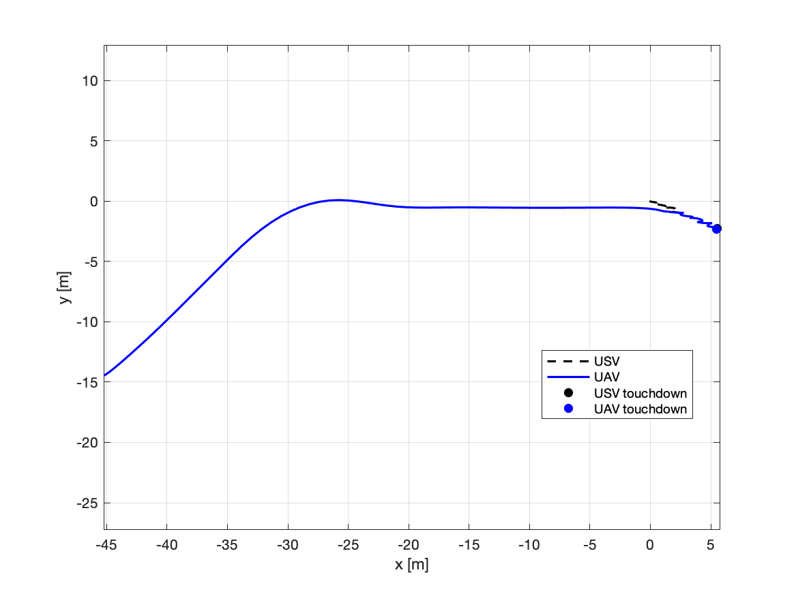
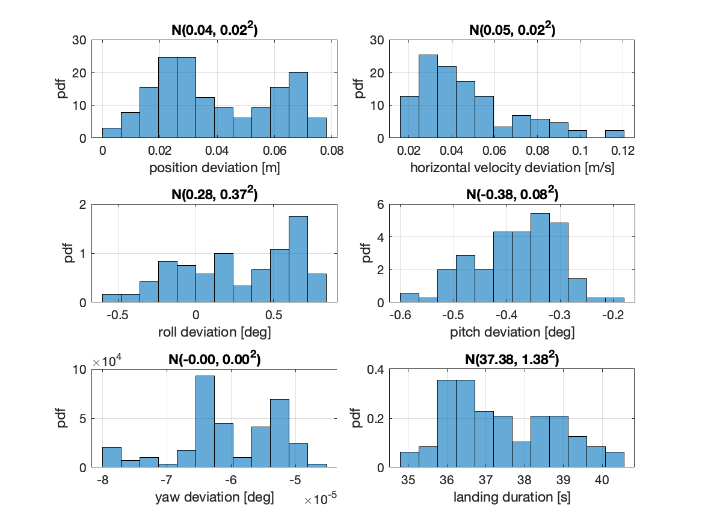

# Agile UAV Landing on a Moving Boat — MPC-FAA Reproduction

[](https://www.mathworks.com/products/matlab.html)
[](https://www.mathworks.com/products/simulink.html)


[](https://doi.org/10.1016/j.oceaneng.2024.119164)

A clean, modular **MATLAB/Simulink reverse-engineering reproduction** of:

> O. Procházka, F. Novák, T. Báča, P. M. Gupta, R. Pěnička, and M. Saska,
> **"Model predictive control-based trajectory generation for agile landing of an unmanned aerial vehicle on a moving boat,"**
> *Ocean Engineering*, vol. 318, p. 119164, 2024.
> DOI: [10.1016/j.oceaneng.2024.119164](https://doi.org/10.1016/j.oceaneng.2024.119164)

Research Internship (Semester II) · ITMO University · Faculty of Control Systems and Robotics
Author: **Oyetunde Jamiu Olaide** (ID 520194) · Supervisor: **Prof. Sergey M. Vlasov**

---

## Summary

The original paper lands a multirotor UAV on the tilting deck of a moving USV by feeding **predicted** USV states (position, orientation, and their first derivatives) into a linear MPC, and by **dynamically re-weighting** the cost so that roll/pitch synchronisation is *forced* as the UAV nears the deck — a mechanism the authors call **Forcing Attitude Alignment (FAA)**. This repository reconstructs that model and controller exactly as specified and reproduces its single-trial and Monte Carlo landing experiments.

**What is reproduced**

- 12-state hover-linearised UAV model (paper Eqs. 12–20), incl. the exact `B_p` input matrix.
- Input-increment (Δu) augmented MPC with a **2 s / 20-step** horizon (Eqs. 21–32).
- Table 4 state/input weighting, including the FAA exponential terms (Eq. 33).
- NAVIGATION / FOLLOW / LANDING mission state machine (paper Fig. 3).
- 3-component Gerstner-wave USV deck predictor (Eqs. 34–35), Moderate-sea settings.
- Paper-style touchdown plots and 100-run Monte Carlo statistics (cf. Figs. 7–9).

## Repository structure

```
.
├── README.md
├── .gitignore
├── src/                     # MATLAB sources (one file per mathematical object)
│   ├── run_all.m            # >> single entry point: single trial + Monte Carlo
│   ├── initialize_paper_parameters.m
│   ├── build_uav_linear_model.m / discretize_uav_model.m
│   ├── build_prediction_matrices.m / solve_mpc_qp.m
│   ├── faa_weight_matrix.m   # time-varying Q(t) with FAA
│   ├── gerstner_usv_motion.m / generate_usv_prediction.m
│   ├── uav_landing_state_machine.m / create_reference_trajectory.m
│   ├── simulate_landing_trial.m
│   ├── build_simulink_model.m / simulink_landing_step.m
│   ├── plot_landing_results.m / plot_monte_carlo_statistics.m
│   └── save_summary.m         # report-ready stats table from saved .mat
├── simulink/
│   └── uav_landing_mpc_faa_model.slx
├── results/                 # simulation outputs
│   ├── figures/             # single-trial & Monte Carlo PNGs
│   ├── monte_carlo_metrics.mat
│   ├── monte_carlo_summary.txt / .csv
│   └── single_trial_result.mat
├── report/                  # thesis report (Abstract + Ch. 1–5 + refs)
│   ├── main.pdf             # compiled thesis (the deliverable)
│   └── main.tex             # LaTeX source
└── docs/
    ├── references_verified.md            # verified IEEE references (DOI links)
    ├── reverse_engineering_report.md
    ├── paper_alignment_notes.md          # paper section/equation → code map
    └── references/                       # source PDFs + previous-semester report
```

## How to run (MATLAB)

Developed and tested against **MATLAB R2021a**. The **Optimization Toolbox** (`quadprog`) is recommended; a projected-gradient fallback is included for installations without it (use it only for smoke-testing, not for paper-faithful results).

```matlab
cd src
run_all          % single landing trial + 100-run Monte Carlo
```

`run_all` writes figures and `.mat` logs to `../results/` and prints a touchdown summary to the console. To run the pieces individually:

```matlab
run_main         % single highlighted landing trial only
run_monte_carlo  % 100-run statistics only
```

After a run, write a report-ready statistics table (mean/std of every touchdown
metric) from the saved `.mat` without re-simulating:

```matlab
save_summary     % -> results/monte_carlo_summary.txt and .csv
```

### Simulink harness

```matlab
cd src
build_simulink_model                       % builds ../simulink/uav_landing_mpc_faa_model.slx
open_system('uav_landing_mpc_faa_model')
sim('uav_landing_mpc_faa_model')
```

## Dependencies

| Requirement | Notes |
|---|---|
| MATLAB R2021a+ | core simulation |
| Optimization Toolbox | `quadprog` for the MPC QP (recommended) |
| Simulink | only for the optional executable harness |

## Results summary

| Metric (Moderate sea, 100 runs) | Original paper (Fig. 9) | This reproduction |
|---|---|---|
| Position deviation (mean) | 0.15 m | 0.039 ± 0.020 m |
| Horizontal velocity (mean) | 0.36 m/s | 0.047 ± 0.023 m/s |
| Roll deviation (std) | 2.85° | 0.37° |
| Pitch deviation (std) | 2.30° | 0.08° |
| Yaw deviation (std) | 0.99° | 0.00° |
| Success rate | 100 % | 100 % |
| Landing manoeuvre | ~6 s | ~8 s (descent → touchdown) |

All 100 randomised trials land successfully. The reproduced deviations are *tighter* than the paper's because the controller is given idealised access to the predicted deck states (no Kalman-estimator RMSE, no low-level tracking lag); see the discussion of deviations in [report/main.tex](report/main.tex), Chapter 4. Re-run `run_all` to regenerate these figures, then `save_summary` for a `results/monte_carlo_summary.{txt,csv}` table.

<p align="center">
  
  
</p>

## Building the report

The compiled thesis is committed as [`report/main.pdf`](report/main.pdf), the primary deliverable. The LaTeX source is [`report/main.tex`](report/main.tex); to rebuild the PDF, compile it twice (the second pass resolves the table of contents and references):

```bash
cd report
pdflatex main && pdflatex main
```
The report is a university-thesis-style document (each chapter starts on a new page): Abstract + Chapters 1–5 + IEEE references with DOI links.

## Fidelity & scope

The paper relies on components that are **not published numerically**: the identified Fossen 6-DOF hydrodynamic matrices, the multi-sensor Kalman estimator ([Novák et al. 2025](https://doi.org/10.1016/j.oceaneng.2025.120606)), the Gazebo/VRX simulator, and the MRS/Pixhawk low-level controller. These are replaced by documented engineering approximations (analytical Gerstner predictor; direct application of the MPC input to the linear model). See `docs/paper_alignment_notes.md` and Chapter 4 of the report for the full list and the resulting deviations.

## Citation

If you use this reproduction, please cite the **original paper**:

> O. Procházka, F. Novák, T. Báča, P. M. Gupta, R. Pěnička, and M. Saska, "Model predictive control-based trajectory generation for agile landing of an unmanned aerial vehicle on a moving boat," *Ocean Engineering*, vol. 318, p. 119164, 2024. doi: [10.1016/j.oceaneng.2024.119164](https://doi.org/10.1016/j.oceaneng.2024.119164)

To cite **this reproduction**:

> O. J. Oyetunde, *Reverse-Engineering Reproduction of Model Predictive Control–Based Trajectory Generation for Agile Landing of a UAV on a Moving Boat*, Research Internship Report (Semester II), ITMO University, Saint Petersburg, Russia, 2026. Available: https://github.com/oyejam/itmo-research-internship

This repository builds on the author's previous-semester report, *"Uncertainty-Aware Model Predictive Control for Constrained Nonlinear Systems: A UAV Landing Case Study"* (ITMO, 2026), included in `docs/references/`.

## License / academic integrity

Reproduction for academic study. All 24 references in `docs/references_verified.md` were individually verified (DOI / open-access PDF) during this work.
